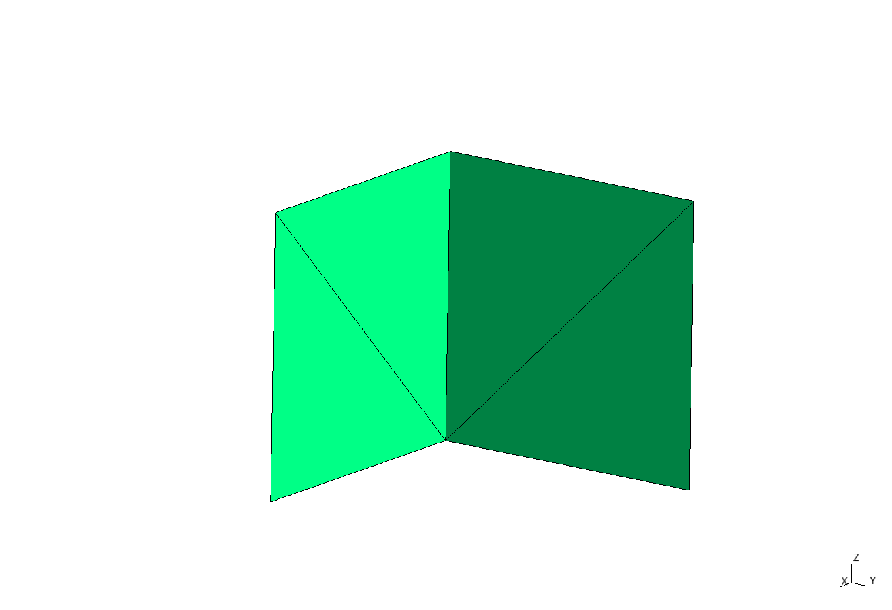
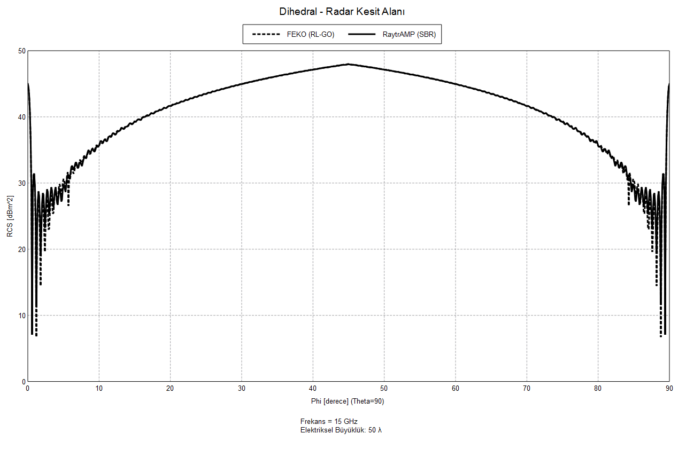
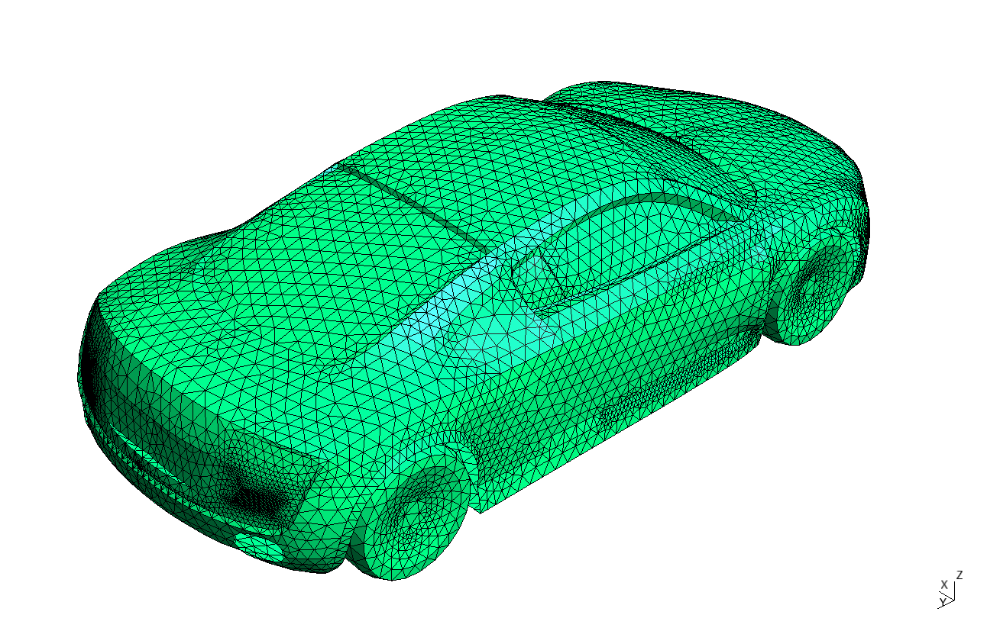
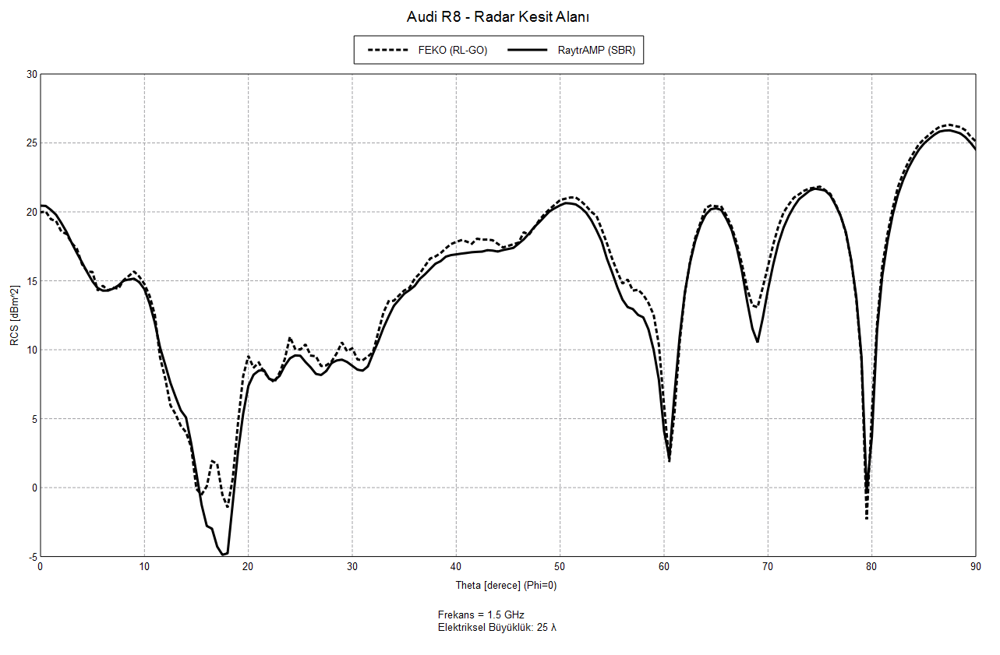
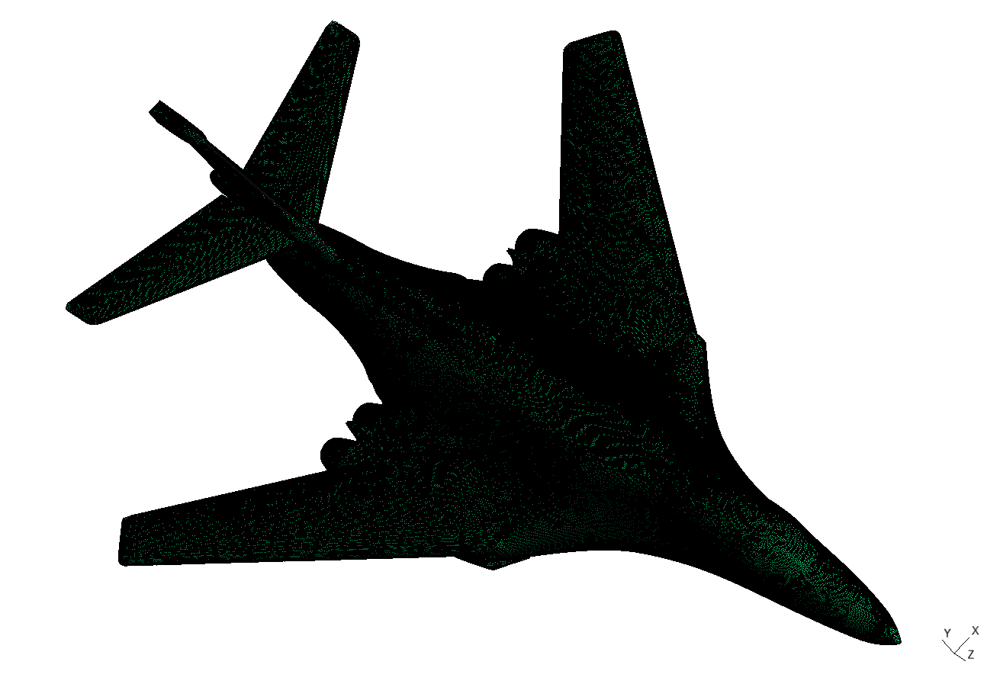
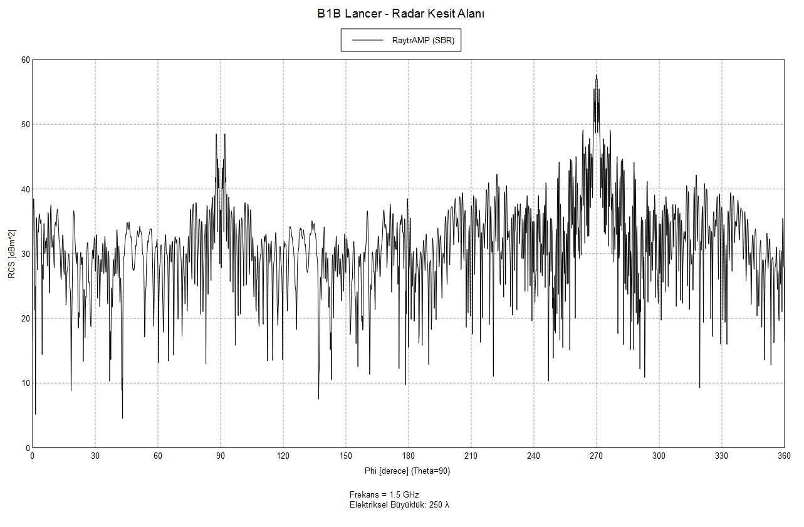

# RaytrAMP

RaytrAMP is an RCS calculation tool that implements shooting and bouncing rays (SBR) method.

SBR method is an approximate electromagnetic solver, that gives accurate results in high frequency and far field range. Compared to full wave solvers such as method of moments, it works faster and requires much less
computational resources. SBR works very similarly to ray tracing in computer graphics.

RaytrAMP is able to calculate monostatic RCS of any arbitrary electrically large complex PEC object.

It works very efficiently and is seriously optimized for speed.

## Features:
* Ray - triangle mesh intersections are accelerated by "bounding volume hierarchy" (BVH).
* Used morton codes for BVH construction, which is much faster than surface area heuristics, and still generates acceptable quality BVHs.
* BVH data structure is stored in contiguous memory. Nodes are connected via their indices, not pointers. This is sometimes called as "Linear BVH" in literature.
* BVH traversal is done on GPU (C++ AMP). Used a non-recursive traversal algorithm, which is sometimes called "stackless BVH traversal" in literature. It just uses a 128-byte very short stack array for each GPU core, which is controlled manually in the code.
* Used "array of structs" instead of "struct of arrays". Even though caching is different on GPUs, this is better for memory locality.
* Whole triangle data is stored in leaf nodes. Exploited "union"s in C++, so that leaf nodes store triangle vertices, instead of child indices and AABB vertices. So that, when a leaf node is fetched, all the triangle data is readily available in it.
* Used Möller-Trumbore algorithm for ray-triangle intersection, which requires no pre-calculation of triangles but still runs almost as fast as other algorithms.
* Used 32-bit floating point numbers. 64-bit numbers consume 2 times more memory and run slower on GPU, yet, it is not necessary for the numerical precision of SBR method. Still, the whole program is readily convertible to 64-bit long numbers, because every class in the code is templated.
* Experimented load balancing on GPU cores. Middle rays hit the object, but corner rays usually do not hit the object and are processed very fast. Some cores only take corner rays, and wait idle. So I distributed each ray randomly to each core to prevent this. But this time, each ray in a core traversed a different path in the tree, and this messed up with the local cache. Because it worked slower.
* Strangely, I found out that, while in the traversal, sorting BVH nodes before adding them to the stack slows down the program. So now, if a ray hits a BVH node, its children are added to the stack without sorting which one is closer, and it works faster.

## How to use?
Visual Studio is needed for compiling C++ programs that uses C++ AMP. There are 2 C++ executables:

1) MakeRBA:
Converts .unv triangle mesh to readily available bounding volume hierarchy array (.rba) files.

2) MonoRCS:
Takes .rba and .obs files as input to calculate monostatic RCS, and then gives an .rcs file as output.

File formats are self explanatory on their C++ import/export classes.

These 2 executables are controlled via MATLAB. Again, MATLAB part is simple and scripts are self explanatory.

## Here are some results:

### Dihedral Reflector:

  

Triangle Count: 4  
Frequency: ~15 GHz  
Electrical Size: ~50λ  
Direction Count: 3600  
RaytrAMP Execution Time: 3 minutes  
FEKO Execution Time: 32 minutes (~10x slower)  

  

### Audi R8:

  

Triangle Count: 20973  
Frequency: ~1.5 GHz  
Electrical Size: ~25λ  
Direction Count: 90  
RaytrAMP Execution Time: 1.5 seconds  
FEKO Execution Time: 15 minutes (~600x slower)  

  

### B-1B Lancer:

  

Triangle Count: 630886  
Frequency: ~1.5 GHz  
Electrical Size: ~250λ  
Direction Count: 2048  
RaytrAMP Execution Time: 30 minutes  
FEKO Execution Time: It takes 2 minutes to finish 1% of 1 direction. So it would require 9 months to finish. Not included for this reason. (~10000x slower)  

  
